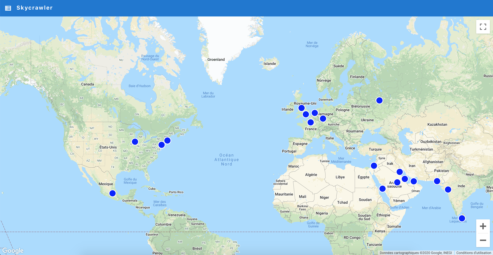

# skycrawler

[](https://travis-ci.org/waxisien/skycrawler)
[](https://coveralls.io/github/waxisien/skycrawler)

A crawler and a webpage to display latest worldwide highrises developments. Data fetched from [skyscrapercity.com](http://www.skyscrapercity.com) forum.



## How to use

Setup the virtualenv:
```
mkvirtualenv -p `which python3.7` skyscraper
pip install -e .
```

Install front-end dependencies:
```
cd front
yarn
```

Set a few env variables:
```
export SKYCRAWLER_DB=<your sql lite db path>
export REACT_APP_GOOGLE_MAP_API_KEY=<google map key>
```

Get data:
```
./scripts/searchengine.py --init-db
```

Launch flask, launch react app in a second terminal and browse page:
```
python bin/dev_server.py
cd front
yarn start
```

Admin access:
```
export SKY_ADMIN_SETTINGS=../conf/admin.cfg
python skycrawler/admin.py
```

Unit test:
```
pip install pytest
pytest .
```
