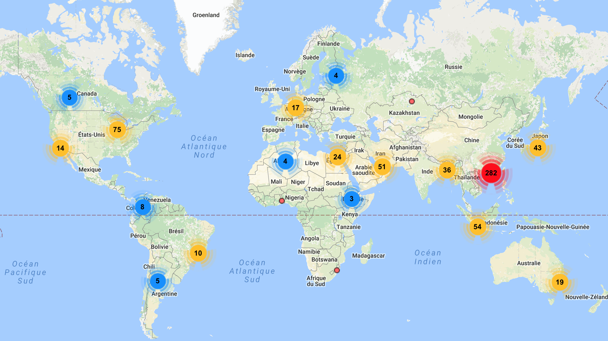

# skyscraper-crawler

A crawler and a webpage to display latest highrises developments. Informations from [skyscrapercity.com](http://www.skyscrapercity.com) forum.



## To test

Setup the virtualenv:
```
mkvirtualenv -p `which python2.7` skyscraper`
pip install -r skyscraper.req
```

Get data:
```
./searchengine.py
```

Launch flask and browse page:
```
python server.py
```
