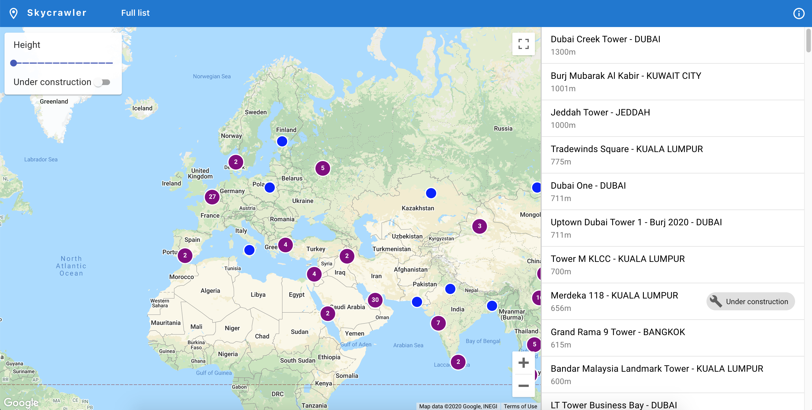

# skycrawler

[](https://travis-ci.org/waxisien/skycrawler)
[](https://coveralls.io/github/waxisien/skycrawler)

A crawler and a webpage to display latest worldwide highrises developments. Data fetched from [skyscrapercity.com](http://www.skyscrapercity.com) forum.



Companion of [skycrawler-react](https://github.com/waxisien/skycrawler-react).

## How to use

### Setup
```
mkvirtualenv -p `which python3.7` skyscraper
pip install -e .
```

Set SQLite path:
```
export SKYCRAWLER_DB=<your SQLite db path>
```

Get data:
```
./scripts/searchengine.py --init-db
```

### Flask server
```
python bin/dev_server.py
```

### Admin app
```
export SKY_ADMIN_SETTINGS=../conf/admin.cfg
python skycrawler/admin.py
```

### Unit tests
```
pip install pytest
pytest tests/
```
